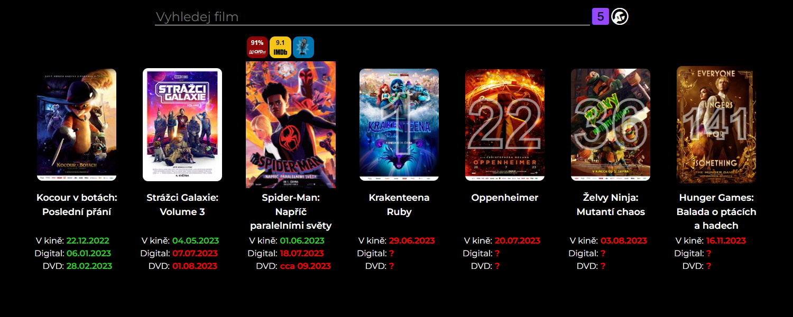

# Kdy Filmy

Jednoduchý web, který zobrazuje datumy vydání filmů v kině, v digitální distribuci a na DVD.

## Funkce
- Vyhledávání filmů
- Datum vydání v kině, v digitální distribuci a na DVD
- Odpočet do datumu vydání
- Hodnocení z ČSFD.cz a IMDb
- Odkazy na ČSFD.cz, IMDb a Dabingforum.cz

## **[▶Web◀](https://tutislav.github.io/kdyfilmy)**

## Snímky obrazovky

## Použité technologie a balíčky
- [PyScript](https://pyscript.net/)
- [Python Sorted Containers](https://github.com/grantjenks/python-sortedcontainers)
- [BeautifulSoup](https://www.crummy.com/software/BeautifulSoup/)
- [lxml](https://github.com/lxml/lxml)
- [Bootstrap Icons](https://icons.getbootstrap.com/)
- [Google Fonts](https://fonts.google.com/)